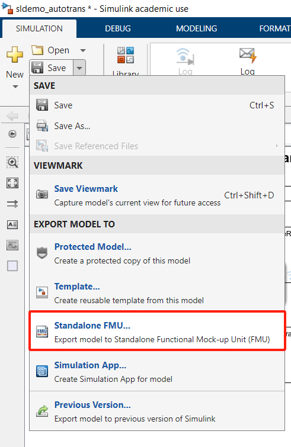

# Things need to be installed: (all need admin) 
- Simulink
- PyCharm
- Automated Driving Toolbox (if needed)
- Computer Vision Toolbox (if needed)
- Image Processing Toolbox (if needed)
- Simulink coder (if needed)
- MATLAB Coder (if needed)

# Steps to compile an FMU from Simulink
1. Build a Simulink model and pre-set the _input pin_ and _output pin_ in the model.
   
2. Select to save to model as **Standalone FMU**.
  
3. Make sure to set the solver as **FixedStepAuto** and keep _FMI Type_ as _Co-Simulation_ if you need to interact with the FMU.
   
   a. Click FixedSetpAuto and set _Type_ as _Fixed-step_, and _Solver_ as _auto_ (other would work but _auto_ would be recommended.
     
4. Click **Create** at the bottom of the _Export Model_ window.

# Steps to interact with an FMU from Python
1. To install the required libraries, run the following commands in your command line:
   ```
   pip install fmpy
   pip install matplotlib
   ```
2. 
